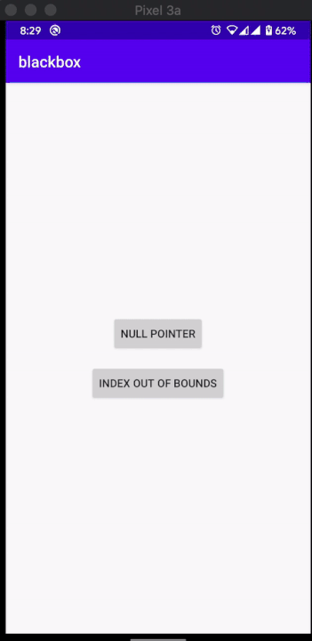

# Blackbox 

Blackbox is a tool that enables your QA team to share the crash logs with you. It displays a notification on restarting the app allowing copy and share options.

## Usage
**Step 1:** Add jitpack in your root build.gradle at the end of repositories:

    allprojects {
            repositories {
                ...
                maven { url 'https://jitpack.io' }
            }
        }

**Step 2:**  Add the dependency

`implementation 'com.github.humblerookie.blackbox:blackbox-main:<version>'`

For release versions there is a no-op version available as well

`implementation 'com.github.humblerookie.blackbox:blackbox-no-op:<version>'`

**Step 3:**
In your application class add the following code

	override fun onCreate(){
		 Blackbox.Builder()
	            .context(this)
	            .init()
	}

### Feature Additions
- Allow multiple crash log storage
- Provide an activity to view all crash logs

### Demo
